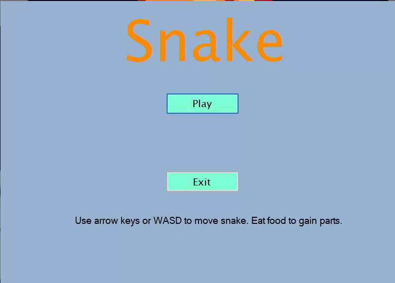

# Snake
This was a project made in my Grade 12 computer science class which demonstrated the use of classes by making a clone of the Snake game. I used C# and Visual Studio to build it.

## Demo

You will need to use Microsoft Visual Studio 15 or higher to build and run.